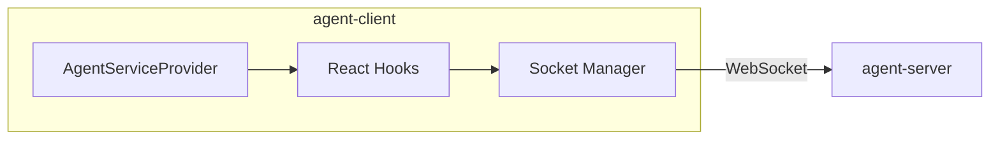

# agent-client

React hooks and client library for connecting to agent-server.

## What It Does

- Provides React hooks for agent session management
- Manages WebSocket connection to agent-server
- Handles message streaming and state updates
- Tracks workspace files and subagent conversations

## Architecture



## Core Components

| Component | File | Purpose |
|-----------|------|---------|
| AgentServiceProvider | `src/context/AgentServiceProvider.tsx` | Context provider |
| useAgentSession | `src/hooks/useAgentSession.ts` | Session lifecycle |
| useMessages | `src/hooks/useMessages.ts` | Conversation blocks |
| useWorkspaceFiles | `src/hooks/useWorkspaceFiles.ts` | File tracking |
| useSubagents | `src/hooks/useSubagents.ts` | Subagent support |
| useLogs | `src/hooks/useLogs.ts` | Session log streaming |
| useEvents | `src/hooks/useEvents.ts` | Debug event log |

## Usage

```tsx
import { AgentServiceProvider, useAgentSession, useMessages } from '@hhopkins/agent-client';

function App() {
  return (
    <AgentServiceProvider apiUrl="http://localhost:3001" wsUrl="http://localhost:3001">
      <ChatUI />
    </AgentServiceProvider>
  );
}

function ChatUI() {
  const { session, createSession } = useAgentSession();
  const { blocks, sendMessage, isStreaming } = useMessages(session?.info.sessionId);

  return (
    <div>
      {blocks.map(block => <Block key={block.id} {...block} />)}
      <Input onSend={sendMessage} disabled={isStreaming} />
    </div>
  );
}
```

## Key Types

```typescript
interface UseAgentSessionReturn {
  session: SessionState | null;
  runtime: SessionRuntimeState | null;
  createSession: (profileRef: string, arch: string) => Promise<string>;
  loadSession: (id: string) => Promise<void>;
  destroySession: () => Promise<void>;
}

interface UseMessagesReturn {
  blocks: ConversationBlock[];
  isStreaming: boolean;
  sendMessage: (content: string) => Promise<void>;
}

interface UseLogsReturn {
  logs: SessionLogEntry[];
  clearLogs: () => void;
  getFilteredLogs: (levels: LogLevel[]) => SessionLogEntry[];
}

interface SessionLogEntry {
  id: string;
  timestamp: number;
  sessionId: string;
  level: 'debug' | 'info' | 'warn' | 'error';
  message: string;
  data?: Record<string, unknown>;
}

type LogLevel = 'debug' | 'info' | 'warn' | 'error';
```

## Hooks

### useLogs

Access session logs streamed from the execution environment.

```tsx
function LogPanel({ sessionId }: { sessionId: string }) {
  const { logs, clearLogs, getFilteredLogs } = useLogs(sessionId);

  // Show only warnings and errors
  const importantLogs = getFilteredLogs(['warn', 'error']);

  return (
    <div>
      <button onClick={clearLogs}>Clear</button>
      {importantLogs.map(log => (
        <div key={log.id}>
          [{log.level}] {log.message}
        </div>
      ))}
    </div>
  );
}
```

### useEvents

Access raw WebSocket events for debugging.

```tsx
function DebugPanel() {
  const { events, clearEvents } = useEvents();

  return (
    <div>
      <button onClick={clearEvents}>Clear</button>
      {events.map(event => (
        <div key={event.id}>
          [{event.eventName}] {JSON.stringify(event.payload)}
        </div>
      ))}
    </div>
  );
}
```

## How It Connects

| Direction | Package | Relationship |
|-----------|---------|--------------|
| Depends on | agent-server | Types + WebSocket |
| Depends on | shared-types | Block types |
| Peer dep | react | React 18 or 19 |

## Related

- [Architecture Overview](../system/architecture-overview.md) - System structure
- [Streaming and Events](../system/streaming-and-events.md) - Event types
- [agent-server](./agent-server.md) - Server connection
