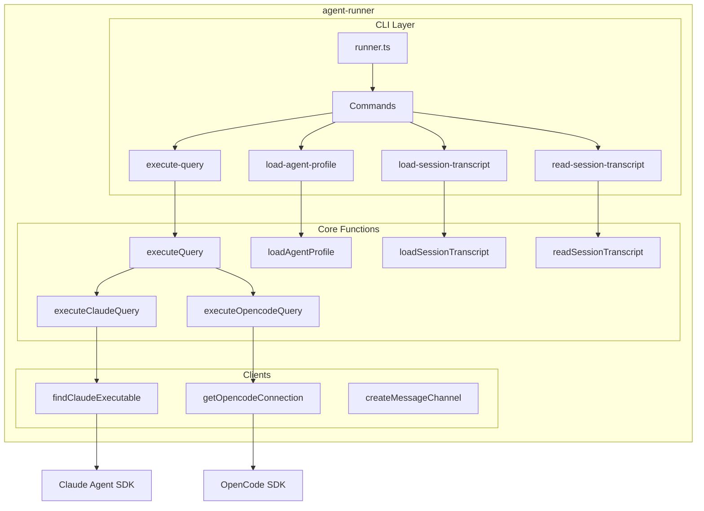

# agent-runner

Execution scripts for running agent queries inside sandboxes.

## What It Does

- Provides CLI scripts for session setup and query execution
- Bundles into a single JavaScript file for sandbox deployment
- Supports multiple AI architectures (Claude SDK, OpenCode SDK)
- Loads agent profiles and entity configurations
- Streams events back to the orchestration layer
- **Core functions directly importable** for testing without subprocess spawning

## Architecture



## Core Components

| Component | File | Purpose |
|-----------|------|---------|
| **Core Functions** | | |
| executeQuery | `src/core/execute-query.ts` | Dispatcher to claude/opencode |
| executeClaudeQuery | `src/core/execute-claude-query.ts` | Claude SDK async generator |
| executeOpencodeQuery | `src/core/execute-opencode-query.ts` | OpenCode SDK async generator |
| loadAgentProfile | `src/core/load-agent-profile.ts` | Write .claude/ config |
| loadSessionTranscript | `src/core/load-session-transcript.ts` | Restore session state |
| readSessionTranscript | `src/core/read-session-transcript.ts` | Extract current transcript |
| **Clients** | | |
| findClaudeExecutable | `src/clients/claude.ts` | Lazy Claude executable finder |
| getOpencodeConnection | `src/clients/opencode.ts` | Lazy OpenCode client init |
| createMessageChannel | `src/clients/channel.ts` | Async producer/consumer channel |
| **CLI Layer** | | |
| CLI Entry | `src/cli/runner.ts` | Command router |
| Commands | `src/cli/commands/*.ts` | Thin wrappers (~20 lines each) |
| I/O Utilities | `src/cli/shared/*.ts` | stdin/stdout helpers |

## Usage

### Direct Import (Recommended for Testing)

Core functions can be imported and called directly without spawning subprocesses:

```typescript
import { executeQuery, loadAgentProfile, createMessageChannel } from '@hhopkins/agent-runner';

// Execute a query - returns AsyncGenerator<StreamEvent>
const input = {
  prompt: 'What is 2 + 2?',
  architecture: 'claude-sdk',
  sessionId: 'my-session',
  cwd: '/workspace'
};

for await (const event of executeQuery(input)) {
  console.log(event);
}

// Load an agent profile
const result = await loadAgentProfile({
  projectDirPath: '/workspace',
  sessionId: 'my-session',
  agentProfile: { id: 'test', name: 'Test', customEntities: {} },
  architectureType: 'claude-sdk'
});
```

### CLI Commands

All commands read JSON from stdin:

```bash
# Load agent profile into workspace
echo '{"projectDirPath":"/workspace",...}' | runner load-agent-profile

# Execute a query
echo '{"prompt":"Hello","architecture":"claude-sdk",...}' | runner execute-query

# Load/read session transcripts
runner load-session-transcript < input.json
runner read-session-transcript < input.json
```

### Sandbox Deployment

```typescript
import { getRunnerBundleContent } from '@hhopkins/agent-runner';

// Get bundled runner.js content
const bundleContent = getRunnerBundleContent();

// Write to sandbox and execute
await sandbox.writeFile('/app/runner.js', bundleContent);
await sandbox.exec(['node', '/app/runner.js', 'execute-query', ...]);
```

### Input Format (load-agent-profile)

```json
{
  "projectDirPath": "/workspace",
  "sessionId": "abc123",
  "agentProfile": {
    "name": "my-agent",
    "systemPrompt": "You are helpful",
    "skills": [...],
    "commands": [...],
    "mcpServers": [...]
  },
  "architectureType": "claude-sdk"
}
```

### CLI Output Format

All CLI commands emit JSONL to stdout. Output is always `StreamEvent | ScriptOutput`:

| Command | Output Format |
|---------|---------------|
| `execute-query` | Streams `StreamEvent` lines (block_start, text_delta, etc.) |
| `load-agent-profile` | Log events + final `ScriptOutput<void>` |
| `load-session-transcript` | Log events + final `ScriptOutput<void>` |
| `read-session-transcript` | `ScriptOutput<{ transcript: string }>` |

**ScriptOutput** is the final result for non-streaming commands:

```typescript
interface ScriptOutput<T = unknown> {
  type: 'script_output';
  success: boolean;
  data?: T;      // Result data on success
  error?: string; // Error message on failure
}
```

Example outputs:

```jsonl
// execute-query (streaming)
{"type":"block_start","blockId":"msg-1","block":{...}}
{"type":"text_delta","blockId":"msg-1","delta":"Hello"}
{"type":"block_complete","blockId":"msg-1","block":{...}}

// load-agent-profile (non-streaming)
{"type":"block_complete","blockId":"log-123","block":{"type":"system","subtype":"log",...}}
{"type":"script_output","success":true}

// read-session-transcript
{"type":"script_output","success":true,"data":{"transcript":"..."}}
```

This unified format allows `ExecutionEnvironment` to use a single JSONL parser for all commands.

## Key Types

```typescript
type AgentArchitecture = 'claude-sdk' | 'opencode';

interface AgentProfile {
  name: string;
  systemPrompt?: string;
  skills: Skill[];
  commands: Command[];
  subagents: Agent[];
  hooks: Hook[];
  mcpServers: McpServerConfig[];
}
```

## How It Connects

| Direction | Package | Relationship |
|-----------|---------|--------------|
| Depends on | converters | Parse/write transcripts |
| Depends on | claude-entity-manager | Load entity configs |
| Depends on | shared-types | Type definitions |
| Used by | agent-server | Spawned in sandboxes |

## Bundle Output

The package builds to a single bundled file:

```text
dist/
├── index.js          # Library exports
├── index.d.ts        # Type declarations
├── runner.js         # CLI entry point
└── runner.bundle.js  # Self-contained bundle for sandboxes
```

The bundle includes all dependencies, making sandboxes self-contained.

## Test Harness

The runner includes a test harness for local testing that mimics how the execution environment invokes runners.

### Running the Harness

```bash
# From runtime/runner directory
pnpm harness <command> [options]

# Or from anywhere in the monorepo
pnpm --filter @hhopkins/agent-runner harness <command> [options]
```

### Commands

| Command | Description |
|---------|-------------|
| `execute-query` | Execute a query against the agent |
| `load-agent-profile` | Load agent profile into workspace |
| `load-session-transcript` | Load session transcript into workspace |
| `read-session-transcript` | Read session transcript from workspace |
| `workflow` | Run complete workflow (profile + query) |

### Example Usage

```bash
# Quick query test with summary output
pnpm harness execute-query \
  --prompt "What is 2+2?" \
  --architecture claude-sdk \
  --format summary

# Full workflow with agent profile
pnpm harness workflow \
  --agent fixtures/agents/minimal.json \
  --prompt "Hello world" \
  --format summary

# Stream events in real-time
pnpm harness execute-query \
  --prompt "List files" \
  --format stream

# Keep workspace for debugging
pnpm harness execute-query \
  --prompt "Create a file" \
  --keep

# Use fixture file for input
pnpm harness execute-query \
  --input fixtures/queries/simple.json \
  --format collect
```

### Output Formats

| Format | Description |
|--------|-------------|
| `stream` | Real-time JSONL output (default) |
| `collect` | Collect all events, output as JSON array |
| `summary` | Human-readable summary with stats |

### Workspace Management

- By default, creates temp directory in `/tmp/runner-harness-*`
- Use `--workspace <dir>` to specify a directory
- Use `--keep` to preserve workspace after run
- Use `--clean` to clean workspace before run (load-agent-profile only)

### Fixtures

Example fixtures are provided in `runtime/runner/fixtures/`:

```text
fixtures/
├── agents/
│   └── minimal.json      # Minimal agent profile
├── sessions/
│   └── empty.json        # Empty session transcript
└── queries/
    └── simple.json       # Simple query input
```

### Using the Harness Programmatically

```typescript
import { runRunner, createWorkspace, parseJsonlStream } from '@hhopkins/agent-runner/test-harness';

// Create workspace
const workspace = await createWorkspace({ keep: true });

// Run a query
const result = await runRunner({
  command: 'execute-query',
  input: {
    prompt: 'Hello',
    sessionId: 'test-123',
    architecture: 'claude-sdk',
    cwd: workspace.path,
  },
  cwd: workspace.path,
  onEvent: (event) => console.log(event),
});

// Parse output
const parsed = parseJsonlStream(result.stdout);
console.log(parsed.summary);

// Cleanup
await workspace.cleanup();
```

## Related

- [Agent Execution](../system/agent-execution.md) - How runner fits in execution flow
- [agent-server](./agent-server.md) - Orchestration that spawns runner
- [agent-converters](./agent-converters.md) - Transcript parsing
