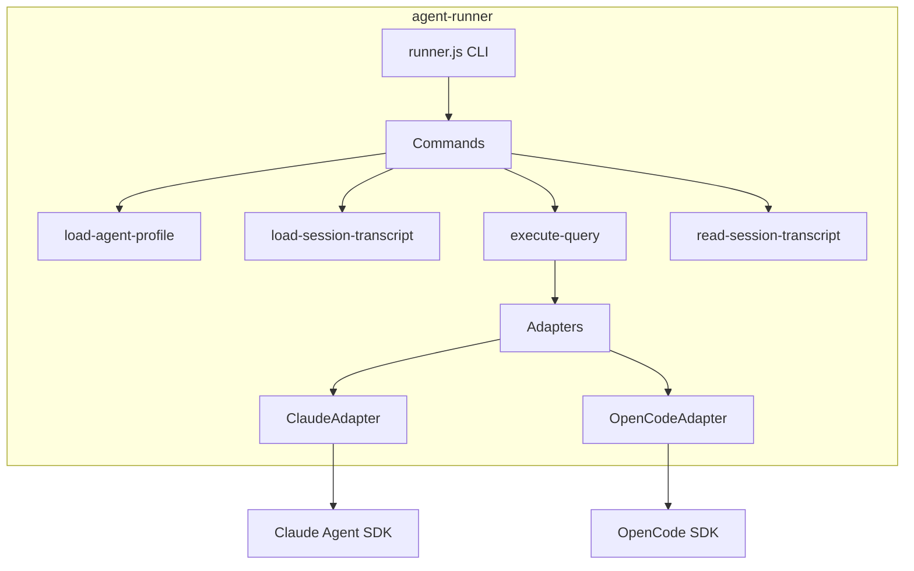

# agent-runner

Execution scripts for running agent queries inside sandboxes.

## What It Does

- Provides CLI scripts for session setup and query execution
- Bundles into a single JavaScript file for sandbox deployment
- Supports multiple AI architectures (Claude SDK, OpenCode SDK)
- Loads agent profiles and entity configurations
- Streams events back to the orchestration layer

## Architecture



## Core Components

| Component | File | Purpose |
|-----------|------|---------|
| CLI Entry | `src/cli/runner.ts` | Command router |
| load-agent-profile | `src/cli/load-agent-profile.ts` | Write .claude/ config |
| execute-query | `src/cli/execute-query.ts` | Run query against SDK |
| load-session-transcript | `src/cli/load-session-transcript.ts` | Restore session state |
| read-session-transcript | `src/cli/read-session-transcript.ts` | Extract current transcript |
| Test Harness CLI | `src/test-harness/cli.ts` | Local testing entry point |
| Process Runner | `src/test-harness/lib/process-runner.ts` | Subprocess spawning |
| Stream Parser | `src/test-harness/lib/stream-parser.ts` | JSONL parsing & summaries |

## Usage

### CLI Commands

```bash
# Load agent profile into workspace
node runner.js load-agent-profile < input.json

# Execute a query
node runner.js execute-query "Hello" \
  --architecture claude-sdk \
  --session-id abc123 \
  --cwd /workspace

# Read session transcript
node runner.js read-session-transcript abc123 \
  --architecture claude-sdk \
  --project-dir /workspace
```

### Programmatic Usage

```typescript
import { getRunnerBundleContent } from '@hhopkins/agent-runner';

// Get bundled runner.js content
const bundleContent = getRunnerBundleContent();

// Write to sandbox and execute
await sandbox.writeFile('/app/runner.js', bundleContent);
await sandbox.exec(['node', '/app/runner.js', 'execute-query', ...]);
```

### Input Format (load-agent-profile)

```json
{
  "projectDirPath": "/workspace",
  "sessionId": "abc123",
  "agentProfile": {
    "name": "my-agent",
    "systemPrompt": "You are helpful",
    "skills": [...],
    "commands": [...],
    "mcpServers": [...]
  },
  "architectureType": "claude-sdk"
}
```

## Key Types

```typescript
type AgentArchitecture = 'claude-sdk' | 'opencode';

interface AgentProfile {
  name: string;
  systemPrompt?: string;
  skills: Skill[];
  commands: Command[];
  subagents: Agent[];
  hooks: Hook[];
  mcpServers: McpServerConfig[];
}
```

## How It Connects

| Direction | Package | Relationship |
|-----------|---------|--------------|
| Depends on | converters | Parse/write transcripts |
| Depends on | claude-entity-manager | Load entity configs |
| Depends on | shared-types | Type definitions |
| Used by | agent-server | Spawned in sandboxes |

## Bundle Output

The package builds to a single bundled file:

```
dist/
├── index.js          # Library exports
├── index.d.ts        # Type declarations
├── runner.js         # CLI entry point
└── runner.bundle.js  # Self-contained bundle for sandboxes
```

The bundle includes all dependencies, making sandboxes self-contained.

## Test Harness

The runner includes a test harness for local testing that mimics how the execution environment invokes runners.

### Running the Harness

```bash
# From runtime/runner directory
pnpm harness <command> [options]

# Or from anywhere in the monorepo
pnpm --filter @hhopkins/agent-runner harness <command> [options]
```

### Commands

| Command | Description |
|---------|-------------|
| `execute-query` | Execute a query against the agent |
| `load-agent-profile` | Load agent profile into workspace |
| `load-session-transcript` | Load session transcript into workspace |
| `read-session-transcript` | Read session transcript from workspace |
| `workflow` | Run complete workflow (profile + query) |

### Example Usage

```bash
# Quick query test with summary output
pnpm harness execute-query \
  --prompt "What is 2+2?" \
  --architecture claude-sdk \
  --format summary

# Full workflow with agent profile
pnpm harness workflow \
  --agent fixtures/agents/minimal.json \
  --prompt "Hello world" \
  --format summary

# Stream events in real-time
pnpm harness execute-query \
  --prompt "List files" \
  --format stream

# Keep workspace for debugging
pnpm harness execute-query \
  --prompt "Create a file" \
  --keep

# Use fixture file for input
pnpm harness execute-query \
  --input fixtures/queries/simple.json \
  --format collect
```

### Output Formats

| Format | Description |
|--------|-------------|
| `stream` | Real-time JSONL output (default) |
| `collect` | Collect all events, output as JSON array |
| `summary` | Human-readable summary with stats |

### Workspace Management

- By default, creates temp directory in `/tmp/runner-harness-*`
- Use `--workspace <dir>` to specify a directory
- Use `--keep` to preserve workspace after run
- Use `--clean` to clean workspace before run (load-agent-profile only)

### Fixtures

Example fixtures are provided in `runtime/runner/fixtures/`:

```
fixtures/
├── agents/
│   └── minimal.json      # Minimal agent profile
├── sessions/
│   └── empty.json        # Empty session transcript
└── queries/
    └── simple.json       # Simple query input
```

### Programmatic Usage

```typescript
import { runRunner, createWorkspace, parseJsonlStream } from '@hhopkins/agent-runner/test-harness';

// Create workspace
const workspace = await createWorkspace({ keep: true });

// Run a query
const result = await runRunner({
  command: 'execute-query',
  input: {
    prompt: 'Hello',
    sessionId: 'test-123',
    architecture: 'claude-sdk',
    cwd: workspace.path,
  },
  cwd: workspace.path,
  onEvent: (event) => console.log(event),
});

// Parse output
const parsed = parseJsonlStream(result.stdout);
console.log(parsed.summary);

// Cleanup
await workspace.cleanup();
```

## Related

- [Agent Execution](../system/agent-execution.md) - How runner fits in execution flow
- [agent-server](./agent-server.md) - Orchestration that spawns runner
- [agent-converters](./agent-converters.md) - Transcript parsing
