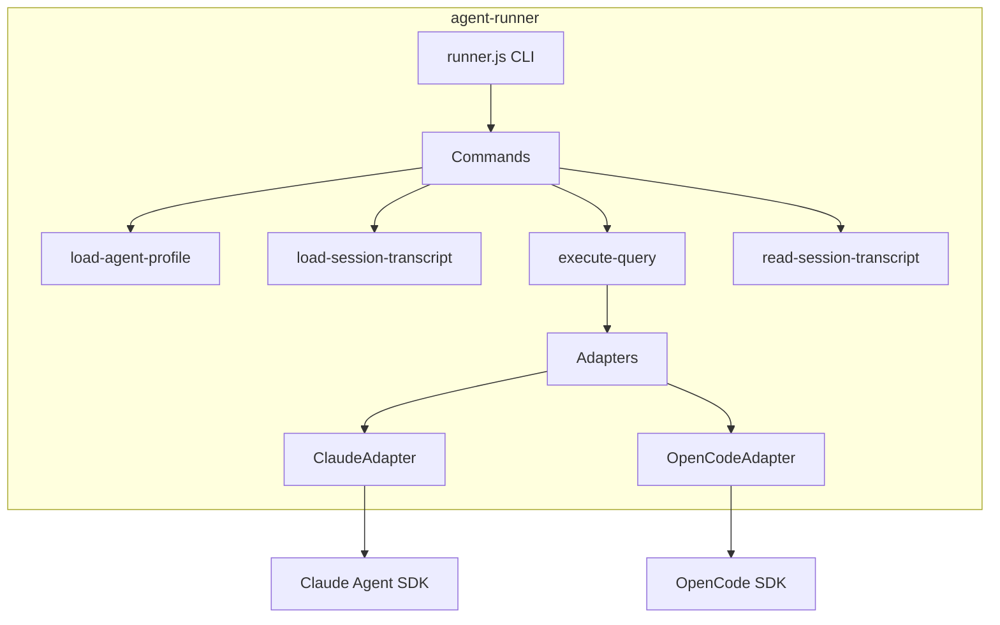

# agent-runner

Execution scripts for running agent queries inside sandboxes.

## What It Does

- Provides CLI scripts for session setup and query execution
- Bundles into a single JavaScript file for sandbox deployment
- Supports multiple AI architectures (Claude SDK, OpenCode SDK)
- Loads agent profiles and entity configurations
- Streams events back to the orchestration layer

## Architecture



## Core Components

| Component | File | Purpose |
|-----------|------|---------|
| CLI Entry | `src/cli/runner.ts` | Command router |
| load-agent-profile | `src/cli/load-agent-profile.ts` | Write .claude/ config |
| execute-query | `src/cli/execute-query.ts` | Run query against SDK |
| load-session-transcript | `src/cli/load-session-transcript.ts` | Restore session state |
| read-session-transcript | `src/cli/read-session-transcript.ts` | Extract current transcript |

## Usage

### CLI Commands

```bash
# Load agent profile into workspace
node runner.js load-agent-profile < input.json

# Execute a query
node runner.js execute-query "Hello" \
  --architecture claude-sdk \
  --session-id abc123 \
  --cwd /workspace

# Read session transcript
node runner.js read-session-transcript abc123 \
  --architecture claude-sdk \
  --project-dir /workspace
```

### Programmatic Usage

```typescript
import { getRunnerBundleContent } from '@hhopkins/agent-runner';

// Get bundled runner.js content
const bundleContent = getRunnerBundleContent();

// Write to sandbox and execute
await sandbox.writeFile('/app/runner.js', bundleContent);
await sandbox.exec(['node', '/app/runner.js', 'execute-query', ...]);
```

### Input Format (load-agent-profile)

```json
{
  "projectDirPath": "/workspace",
  "sessionId": "abc123",
  "agentProfile": {
    "name": "my-agent",
    "systemPrompt": "You are helpful",
    "skills": [...],
    "commands": [...],
    "mcpServers": [...]
  },
  "architectureType": "claude-sdk"
}
```

## Key Types

```typescript
type AgentArchitecture = 'claude-sdk' | 'opencode';

interface AgentProfile {
  name: string;
  systemPrompt?: string;
  skills: Skill[];
  commands: Command[];
  subagents: Agent[];
  hooks: Hook[];
  mcpServers: McpServerConfig[];
}
```

## How It Connects

| Direction | Package | Relationship |
|-----------|---------|--------------|
| Depends on | converters | Parse/write transcripts |
| Depends on | claude-entity-manager | Load entity configs |
| Depends on | shared-types | Type definitions |
| Used by | agent-server | Spawned in sandboxes |

## Bundle Output

The package builds to a single bundled file:

```
dist/
├── index.js          # Library exports
├── index.d.ts        # Type declarations
├── runner.js         # CLI entry point
└── runner.bundle.js  # Self-contained bundle for sandboxes
```

The bundle includes all dependencies, making sandboxes self-contained.

## Related

- [Agent Execution](../system/agent-execution.md) - How runner fits in execution flow
- [agent-server](./agent-server.md) - Orchestration that spawns runner
- [agent-converters](./agent-converters.md) - Transcript parsing
