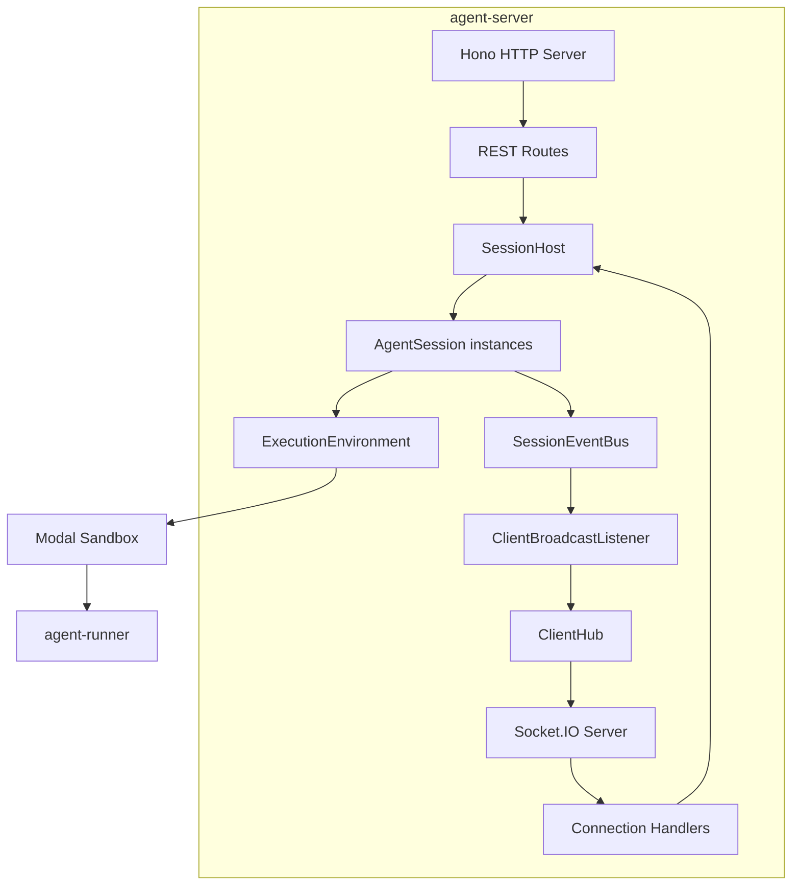

# agent-server

Node.js runtime for orchestrating AI agents in isolated Modal sandboxes.

## What It Does

- Orchestrates agent sessions via WebSocket connections
- Manages sandbox lifecycle (create, execute, terminate)
- Routes messages between clients and agent processes
- Streams events in real-time to connected clients
- Persists session state via adapter pattern

## Architecture



## Core Components

| Component | File | Purpose |
|-----------|------|---------|
| createLocalHost | `src/hosts/local/index.ts` | Factory for local session hosting |
| SessionHost | `src/core/host/session-host.ts` | Session lifecycle interface |
| LocalSessionHost | `src/hosts/local/local-session-host.ts` | In-memory session hosting |
| AgentSession | `src/core/session/agent-session.ts` | Individual session with event bus |
| ExecutionEnvironment | `src/core/session/execution-environment.ts` | Sandbox abstraction |
| SessionEventBus | `src/core/session/session-event-bus.ts` | Per-session events |
| ClientHub | `src/core/host/client-hub.ts` | Client broadcast interface |
| EnvironmentPrimitives | `src/lib/environment-primitives/` | Modal/local implementations |

## Usage

```typescript
import { createAgentRuntime } from '@hhopkins/agent-server';

// Create runtime with full config
const runtime = await createAgentRuntime({
  persistence: myPersistenceAdapter,
  executionEnvironment: {
    type: 'modal',
    modal: {
      tokenId: process.env.MODAL_TOKEN_ID!,
      tokenSecret: process.env.MODAL_TOKEN_SECRET!,
      appName: 'my-agents',
    },
  },
  host: { type: 'local' }
});

// Start runtime
await runtime.start();

// Create REST API
const app = runtime.createRestServer({ apiKey: process.env.API_KEY });

// Attach Socket.IO transport to HTTP server (local host only)
runtime.attachTransport?.(httpServer);

// Access persistence directly if needed
const sessions = await runtime.persistence.listAllSessions();
```

### API Endpoints

```
GET  /health              - Health check
GET  /sessions            - List all sessions
POST /sessions            - Create new session
GET  /sessions/:id        - Get session details
DELETE /sessions/:id      - Delete session
```

### WebSocket Events

```typescript
// Client → Server
socket.emit('session:create', { agentProfileRef, architecture });
socket.emit('session:message', { sessionId, content });

// Server → Client
socket.on('stream:event', ({ sessionId, event }) => {});
socket.on('session:status', ({ sessionId, runtime }) => {});
```

## Key Types

```typescript
interface RuntimeConfig {
  persistence: PersistenceAdapter;
  modal: { tokenId: string; tokenSecret: string; appName: string };
  idleTimeoutMs?: number;
  websocketPort?: number;
}

interface CreateSessionArgs {
  agentProfileRef: string;
  architecture: AgentArchitecture;
  sessionOptions?: AgentArchitectureSessionOptions;
}
```

## How It Connects

| Direction | Package | Relationship |
|-----------|---------|--------------|
| Depends on | agent-runner | Spawns in sandboxes |
| Depends on | converters | Parse transcripts |
| Depends on | shared-types | Type definitions |
| Used by | agent-client | WebSocket connection |

## Related

- [Core Concepts](../system/core-concepts.md) - SessionHost, SessionEventBus, ClientHub patterns
- [Architecture Overview](../system/architecture-overview.md) - System structure
- [Session Lifecycle](../system/session-lifecycle.md) - Session management
- [Hosting Strategies](../guides/hosting-strategies.md) - Deployment options
- [agent-client](./agent-client.md) - Client connection
- [agent-runner](./agent-runner.md) - Sandbox execution
