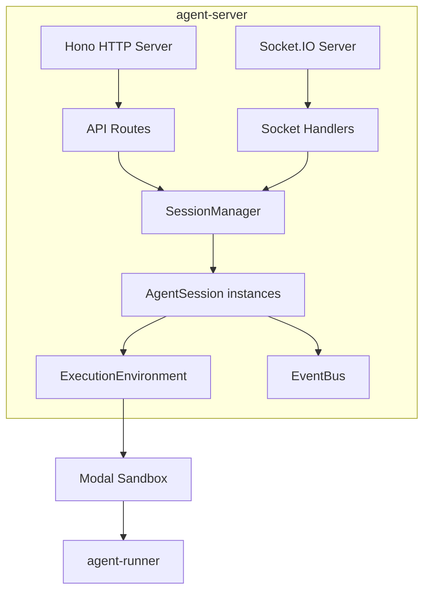

# agent-server

Node.js runtime for orchestrating AI agents in isolated Modal sandboxes.

## What It Does

- Orchestrates agent sessions via WebSocket connections
- Manages sandbox lifecycle (create, execute, terminate)
- Routes messages between clients and agent processes
- Streams events in real-time to connected clients
- Persists session state via adapter pattern

## Architecture



## Core Components

| Component | File | Purpose |
|-----------|------|---------|
| Server Entry | `src/index.ts` | HTTP + WebSocket setup |
| SessionManager | `src/core/session-manager.ts` | Session container |
| AgentSession | `src/core/agent-session.ts` | Individual session state |
| ExecutionEnvironment | `src/core/execution-environment.ts` | Sandbox abstraction |
| EventBus | `src/core/event-bus.ts` | Domain events |
| EnvironmentPrimitives | `src/lib/environment-primitives/` | Modal/local implementations |

## Usage

```typescript
import { AgentRuntime } from '@hhopkins/agent-server';
import type { RuntimeConfig } from '@hhopkins/agent-server/types';

const config: RuntimeConfig = {
  persistence: myPersistenceAdapter,
  modal: {
    tokenId: process.env.MODAL_TOKEN_ID!,
    tokenSecret: process.env.MODAL_TOKEN_SECRET!,
    appName: 'my-agents',
  },
};

const runtime = new AgentRuntime(config);
await runtime.start();
```

### API Endpoints

```
GET  /health              - Health check
GET  /sessions            - List all sessions
POST /sessions            - Create new session
GET  /sessions/:id        - Get session details
DELETE /sessions/:id      - Delete session
```

### WebSocket Events

```typescript
// Client → Server
socket.emit('session:create', { agentProfileRef, architecture });
socket.emit('session:message', { sessionId, content });

// Server → Client
socket.on('stream:event', ({ sessionId, event }) => {});
socket.on('session:status', ({ sessionId, runtime }) => {});
```

## Key Types

```typescript
interface RuntimeConfig {
  persistence: PersistenceAdapter;
  modal: { tokenId: string; tokenSecret: string; appName: string };
  idleTimeoutMs?: number;
  websocketPort?: number;
}

interface CreateSessionArgs {
  agentProfileRef: string;
  architecture: AgentArchitecture;
  sessionOptions?: AgentArchitectureSessionOptions;
}
```

## How It Connects

| Direction | Package | Relationship |
|-----------|---------|--------------|
| Depends on | agent-runner | Spawns in sandboxes |
| Depends on | converters | Parse transcripts |
| Depends on | shared-types | Type definitions |
| Used by | agent-client | WebSocket connection |

## Related

- [Architecture Overview](../system/architecture-overview.md) - System structure
- [Session Lifecycle](../system/session-lifecycle.md) - Session management
- [agent-client](./agent-client.md) - Client connection
- [agent-runner](./agent-runner.md) - Sandbox execution
