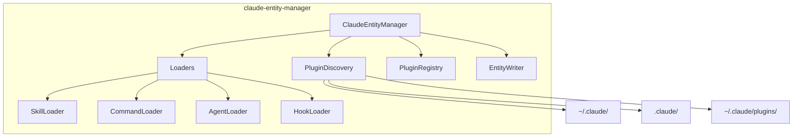

# claude-entity-manager

Service for discovering and managing Claude Code entities and plugins.

## What It Does

- Discovers entities from global, project, and plugin sources
- Loads and parses entity configurations (skills, commands, agents, hooks)
- Manages plugin installation, enabling, and updates
- Assembles agent context for sessions
- Writes entities to project directories

## Architecture



## Core Components

| Component | File | Purpose |
|-----------|------|---------|
| ClaudeEntityManager | `src/ClaudeEntityManager.ts` | Main service |
| PluginDiscovery | `src/discovery/PluginDiscovery.ts` | Find plugins |
| SkillLoader | `src/loaders/SkillLoader.ts` | Parse skills |
| CommandLoader | `src/loaders/CommandLoader.ts` | Parse commands |
| EntityWriter | `src/installation/EntityWriter.ts` | Write entities |
| PluginInstaller | `src/installation/PluginInstaller.ts` | Install plugins |

## Usage

```typescript
import { ClaudeEntityManager } from '@hhopkins/claude-entity-manager';

const manager = new ClaudeEntityManager({
  projectDir: '/path/to/project',
});

// Load complete agent context
const context = await manager.loadAgentContext();
// Returns: { skills, commands, subagents, hooks, mcpServers, memoryFiles }

// Plugin management
await manager.installPlugin('plugin@marketplace');
await manager.enablePlugin('plugin-id');
await manager.disablePlugin('plugin-id');

// Write entities to project
await manager.writeProjectSkill({ name: 'my-skill', description: '...', content: '...' });
```

## Key Types

```typescript
interface ClaudeEntityManagerOptions {
  claudeDir?: string;      // Default: ~/.claude
  projectDir?: string;     // Project root
  includeDisabled?: boolean;
}

interface AgentContext {
  skills: Skill[];
  commands: Command[];
  subagents: Agent[];
  hooks: Hook[];
  mcpServers: McpServerWithSource[];
  memoryFiles: MemoryFile[];
}

interface EntitySource {
  type: 'global' | 'project' | 'plugin';
  pluginId?: string;
  marketplace?: string;
}
```

## How It Connects

| Direction | Package | Relationship |
|-----------|---------|--------------|
| Depends on | shared-types | Entity types |
| Used by | agent-runner | Load profiles |
| Used by | smart-docs | Display entities |
| Used by | opencode-claude-adapter | Sync entities |

## Related

- [Entity Management](../system/entity-management.md) - System overview
- [agent-runner](./agent-runner.md) - Uses entity manager
- [opencode-claude-adapter](./opencode-claude-adapter.md) - Syncs entities
