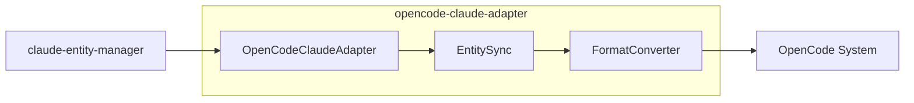

# opencode-claude-adapter

Adapter for syncing Claude Code entities to OpenCode.

## What It Does

- Syncs Claude Code entities (skills, commands, agents) to OpenCode format
- Converts entity formats between systems
- Enables Claude Code plugins to work in OpenCode
- Provides bidirectional sync capabilities

## Architecture



## Core Components

| Component | File | Purpose |
|-----------|------|---------|
| OpenCodeClaudeAdapter | `src/index.ts` | Main adapter |
| EntitySync | `src/sync.ts` | Synchronization logic |
| FormatConverter | `src/converter.ts` | Format transformation |

## Usage

```typescript
import { OpenCodeClaudeAdapter } from '@ai-systems/opencode-claude-adapter';
import { ClaudeEntityManager } from '@hhopkins/claude-entity-manager';

const entityManager = new ClaudeEntityManager({
  projectDir: '/path/to/project',
});

const adapter = new OpenCodeClaudeAdapter({
  entityManager,
  targetDir: '/path/to/opencode/project',
});

// Sync all entities
await adapter.syncAll();

// Sync selectively
await adapter.syncSkills();
await adapter.syncCommands();
```

## Key Types

```typescript
interface OpenCodeClaudeAdapterOptions {
  entityManager: ClaudeEntityManager;
  targetDir: string;
  overwrite?: boolean;
}

interface SyncResult {
  synced: string[];
  skipped: string[];
  errors: SyncError[];
}
```

## How It Connects

| Direction | Package | Relationship |
|-----------|---------|--------------|
| Depends on | claude-entity-manager | Entity loading |
| Depends on | shared-types | Type definitions |
| Uses | @opencode-ai/sdk | OpenCode integration |

## Related

- [Entity Management](../system/entity-management.md) - Entity system
- [claude-entity-manager](./claude-entity-manager.md) - Entity loading
