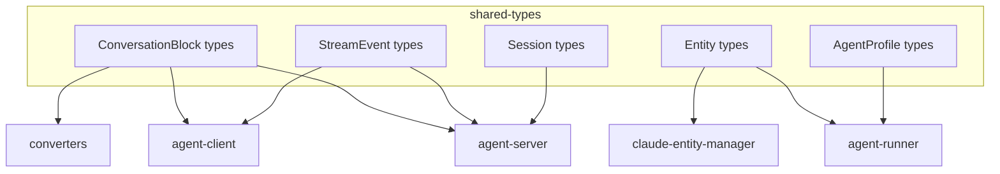

# shared-types

Shared TypeScript type definitions used across all packages.

## What It Does

- Defines common types for the entire monorepo
- Provides ConversationBlock and StreamEvent types
- Defines entity types (Skill, Command, Agent, Hook)
- Ensures type consistency across packages

## Architecture



## Core Components

| Component | File | Purpose |
|-----------|------|---------|
| ConversationBlock | `src/blocks.ts` | Message block types |
| StreamEvent | `src/streaming.ts` | Real-time event types |
| Entity types | `src/entities.ts` | Skill, Command, Agent, Hook |
| Session types | `src/session.ts` | Session data structures |
| AgentProfile | `src/agent-profile.ts` | Agent configuration |

## Usage

```typescript
import type {
  ConversationBlock,
  TextBlock,
  ToolUseBlock,
  StreamEvent,
  Skill,
  Command,
  Agent,
  AgentProfile,
  SessionListItem,
} from '@ai-systems/shared-types';
```

## Key Types

### ConversationBlock

```typescript
type ConversationBlock =
  | TextBlock
  | ToolUseBlock
  | ToolResultBlock
  | ImageBlock;

interface TextBlock {
  type: 'text';
  role: 'user' | 'assistant';
  content: string;
  timestamp?: string;
}

interface ToolUseBlock {
  type: 'tool_use';
  toolName: string;
  toolId: string;
  input: Record<string, unknown>;
}

interface ToolResultBlock {
  type: 'tool_result';
  toolId: string;
  output: string;
  isError: boolean;
}
```

### StreamEvent

```typescript
type StreamEvent =
  | { type: 'text_delta'; delta: string }
  | { type: 'tool_use_start'; toolName: string; toolId: string }
  | { type: 'tool_use_delta'; delta: string }
  | { type: 'tool_result'; result: unknown }
  | { type: 'message_complete'; content: string }
  | { type: 'error'; message: string };
```

### Entity Types

```typescript
interface Skill {
  name: string;
  description: string;
  content?: string;
  source: EntitySource;
}

interface Command {
  name: string;
  description: string;
  content: string;
  arguments?: CommandArgument[];
  source: EntitySource;
}

interface Agent {
  name: string;
  description: string;
  systemPrompt: string;
  tools?: string[];
  model?: string;
  source: EntitySource;
}

interface Hook {
  event: HookEvent;
  command: string;
  matcher?: string;
  source: EntitySource;
}
```

### Session Types

```typescript
interface SessionListItem {
  sessionId: string;
  name: string;
  agentProfileRef: string;
  architecture: AgentArchitecture;
  createdAt: string;
  updatedAt: string;
  runtime: SessionRuntimeState;
}

interface SessionRuntimeState {
  isLoaded: boolean;
  sandbox: {
    id: string;
    status: 'starting' | 'running' | 'stopped';
  } | null;
}
```

## How It Connects

| Direction | Package | Relationship |
|-----------|---------|--------------|
| Used by | agent-server | Session and event types |
| Used by | agent-client | Block and event types |
| Used by | agent-runner | Profile and entity types |
| Used by | converters | Block types |
| Used by | claude-entity-manager | Entity types |

## Related

- [Streaming and Events](../system/streaming-and-events.md) - How types are used
- [Session Lifecycle](../system/session-lifecycle.md) - Session type usage
- [Entity Management](../system/entity-management.md) - Entity type usage
