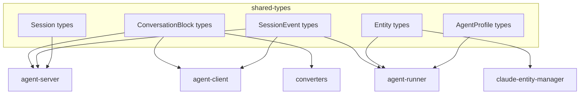

# shared-types

Shared TypeScript type definitions used across all packages.

## What It Does

- Defines common types for the entire monorepo
- Provides ConversationBlock and SessionEvent types
- Defines entity types (Skill, Command, Agent, Hook)
- Ensures type consistency across packages

## Architecture



## Core Components

| Component | File | Purpose |
|-----------|------|---------|
| ConversationBlock | `src/runtime/blocks.ts` | Message block types |
| SessionEvent | `src/runtime/session-events.ts` | Unified real-time event types |
| Entity types | `src/entities/` | Skill, Command, Agent, Hook |
| Session types | `src/runtime/session.ts` | Session data structures |
| AgentProfile | `src/agent-profile.ts` | Agent configuration |

## Usage

```typescript
import type {
  ConversationBlock,
  TextBlock,
  ToolUseBlock,
  SessionEvent,
  SessionEventType,
  SessionEventPayloads,
  AnySessionEvent,
  Skill,
  Command,
  Agent,
  AgentProfile,
  SessionListItem,
} from '@ai-systems/shared-types';

import {
  createSessionEvent,
  enrichEventContext,
  isSessionEventType,
} from '@ai-systems/shared-types';
```

## Key Types

### ConversationBlock

```typescript
type ConversationBlock =
  | TextBlock
  | ToolUseBlock
  | ToolResultBlock
  | ImageBlock;

interface TextBlock {
  type: 'text';
  role: 'user' | 'assistant';
  content: string;
  timestamp?: string;
}

interface ToolUseBlock {
  type: 'tool_use';
  toolName: string;
  toolId: string;
  input: Record<string, unknown>;
}

interface ToolResultBlock {
  type: 'tool_result';
  toolId: string;
  output: string;
  isError: boolean;
}
```

### SessionEvent

A unified event system with consistent `{ type, payload, context }` structure that flows unchanged from runner to client.

**Event structure:**
```typescript
interface SessionEvent<K extends SessionEventType> {
  type: K;                        // Event type key
  payload: SessionEventPayloads[K]; // Type-safe payload
  context: SessionEventContext;   // Session context
}

interface SessionEventContext {
  sessionId: string;           // Added by server
  conversationId?: string;     // 'main' or subagent ID
  source?: 'runner' | 'server'; // Where event originated
  timestamp?: string;          // ISO timestamp
}
```

**Event types** (defined in `SessionEventPayloads`):
```typescript
// Block streaming events
'block:start'    // { block: ConversationBlock }
'block:delta'    // { blockId: string, delta: string }
'block:update'   // { blockId: string, updates: Partial<ConversationBlock> }
'block:complete' // { blockId: string, block: ConversationBlock }

// Metadata events
'metadata:update' // { metadata: SessionMetadata }

// Runtime status events
'status'          // { runtime: SessionRuntimeState }

// File events (server-originated)
'file:created'   // { file: WorkspaceFile }
'file:modified'  // { file: WorkspaceFile }
'file:deleted'   // { path: string }

// Operational events
'log'    // { level?, message, data? }
'error'  // { message, code?, data? }
```

**Factory functions:**
```typescript
// Create a new event
const event = createSessionEvent('block:start', { block }, {
  conversationId: 'main',
  source: 'runner'
});

// Enrich context without transforming payload
const enriched = enrichEventContext(event, { sessionId: '123' });

// Type guard for event type
if (isSessionEventType(event, 'block:delta')) {
  console.log(event.payload.delta); // TypeScript knows the type
}
```

**ScriptOutput** (separate from SessionEvent) is used for non-streaming CLI command results:
```typescript
interface ScriptOutput<T = unknown> {
  type: 'script_output';
  success: boolean;
  data?: T;
  error?: string;
}
```

### Entity Types

```typescript
interface Skill {
  name: string;
  description: string;
  content?: string;
  source: EntitySource;
}

interface Command {
  name: string;
  description: string;
  content: string;
  arguments?: CommandArgument[];
  source: EntitySource;
}

interface Agent {
  name: string;
  description: string;
  systemPrompt: string;
  tools?: string[];
  model?: string;
  source: EntitySource;
}

interface Hook {
  event: HookEvent;
  command: string;
  matcher?: string;
  source: EntitySource;
}
```

### Session Types

```typescript
interface SessionListItem {
  sessionId: string;
  name: string;
  agentProfileRef: string;
  architecture: AgentArchitecture;
  createdAt: string;
  updatedAt: string;
  runtime: SessionRuntimeState;
}

type ExecutionEnvironmentStatus =
  | 'inactive'     // No environment exists
  | 'starting'     // Being created/initialized
  | 'ready'        // Healthy and running
  | 'error'        // Encountered an error
  | 'terminated';  // Shut down

interface SessionRuntimeState {
  /** Whether the session is loaded in memory on the server */
  isLoaded: boolean;

  /** Execution environment state (null if no environment exists) */
  executionEnvironment: {
    id?: string;
    status: ExecutionEnvironmentStatus;
    statusMessage?: string;
    lastHealthCheck?: number;
    restartCount?: number;
    lastError?: {
      message: string;
      code?: string;
      timestamp: number;
    };
  } | null;

  /** Active query state (undefined if no query running) */
  activeQuery?: {
    startedAt: number;
  };
}
```

## How It Connects

| Direction | Package | Relationship |
|-----------|---------|--------------|
| Used by | agent-server | Session and event types |
| Used by | agent-client | Block and event types |
| Used by | agent-runner | Profile and entity types |
| Used by | converters | Block types |
| Used by | claude-entity-manager | Entity types |

## Related

- [Streaming and Events](../system/streaming-and-events.md) - How types are used
- [Session Lifecycle](../system/session-lifecycle.md) - Session type usage
- [Entity Management](../system/entity-management.md) - Entity type usage
