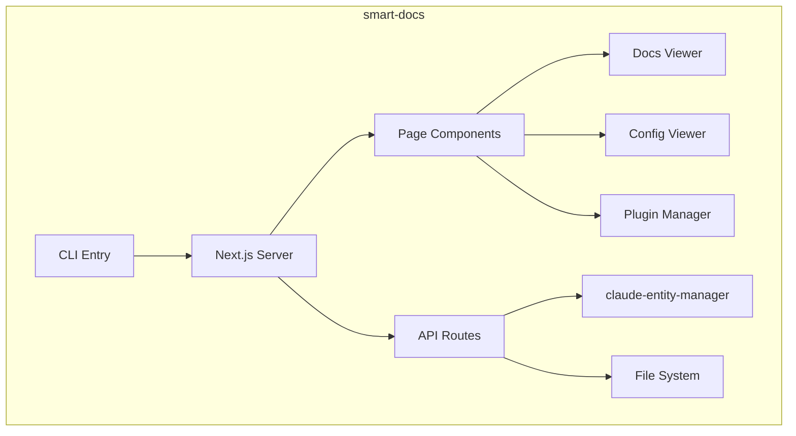

# smart-docs

Local documentation viewer for AI-native codebases.

## What It Does

- Serves project documentation as a local web app
- Renders Markdown with syntax highlighting and Mermaid diagrams
- Shows Claude Code configuration (skills, commands, agents, hooks)
- Provides plugin management interface
- Watches files for live updates

## Architecture



## Core Components

| Component | File | Purpose |
|-----------|------|---------|
| CLI | `src/cli.ts` | Start server |
| DocsViewer | `src/pages/docs/` | Markdown rendering |
| ConfigViewer | `src/pages/config/` | Entity display |
| PluginManager | `src/pages/plugins/` | Plugin UI |

## Usage

```bash
# Start for current directory
npx smart-docs

# Start for specific directory
npx smart-docs /path/to/project

# Specify port
npx smart-docs --port 4000
```

Navigate to `http://localhost:3002`:

- **Docs** - Browse `docs/` folder as rendered Markdown
- **Config** - View skills, commands, agents, hooks
- **Plugins** - Manage installed plugins

## Key Types

```typescript
interface SmartDocsConfig {
  port?: number;
  projectDir: string;
  docsDir?: string;  // Default: docs/
}
```

## Tech Stack

- **Next.js 15** - React framework
- **React 19** - UI library
- **Tailwind CSS** - Styling
- **Socket.IO** - Live reloading
- **Remark** - Markdown processing

## How It Connects

| Direction | Package | Relationship |
|-----------|---------|--------------|
| Depends on | claude-entity-manager | Load entities |
| Depends on | shared-types | Type definitions |

## Related

- [Entity Management](../system/entity-management.md) - Entity loading
- [claude-entity-manager](./claude-entity-manager.md) - Entity service
