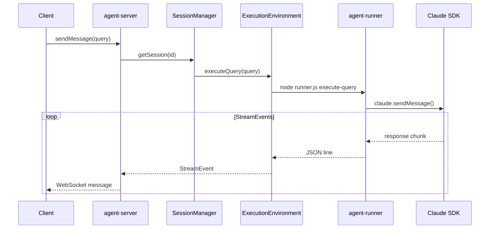
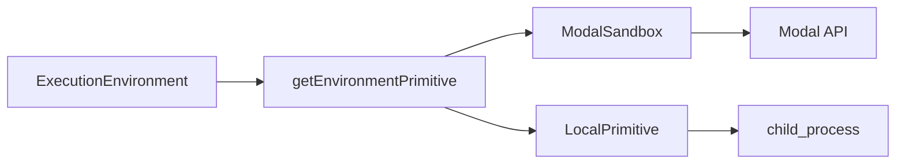

# Agent Execution

How user queries are executed against AI agents in isolated sandboxes.

## What It Does

Agent execution handles the flow from user input to AI response:

- Spawns isolated execution environments (Modal sandboxes)
- Prepares session context (agent profile, workspace files, transcripts)
- Executes queries via the agent-runner CLI
- Streams response events back to the client

## How It Works



### 1. Environment Preparation

Before executing queries, the ExecutionEnvironment sets up the sandbox:

```typescript
await executionEnv.prepareSession({
  sessionId,
  agentProfile,        // Skills, system prompt, tools
  workspaceFiles,      // User's project files
  sessionTranscript,   // Previous conversation (if resuming)
});
```

This invokes `runner.js load-agent-profile` to write `.claude/` configuration.

### 2. Query Execution

Queries are executed via the runner CLI:

```bash
node runner.js execute-query "user message" \
  --architecture claude-sdk \
  --session-id abc123 \
  --cwd /workspace
```

The runner streams JSON events to stdout, one per line.

### 3. Event Streaming

Events flow as newline-delimited JSON:

```json
{"type": "text_delta", "delta": "Hello"}
{"type": "text_delta", "delta": " world"}
{"type": "message_complete", "content": "Hello world"}
```

ExecutionEnvironment parses these and yields `StreamEvent` objects.

## Key Components

| Component | Package | Purpose |
|-----------|---------|---------|
| ExecutionEnvironment | agent-server | Sandbox abstraction |
| EnvironmentPrimitive | agent-server | Low-level sandbox ops (Modal, local) |
| agent-runner CLI | agent-runner | Query execution in sandbox |
| ArchitectureAdapter | converters | SDK-specific execution |

## Environment Primitives

The ExecutionEnvironment delegates to EnvironmentPrimitive implementations:



| Primitive | Use Case |
|-----------|----------|
| ModalSandbox | Production: isolated containers via Modal |
| LocalPrimitive | Development: local child processes |

## Key Insight

The runner is a **bundled JavaScript file** copied into each sandbox. This makes sandboxes self-contained—they don't need npm install. The bundle includes all adapter logic for different AI SDKs.

## Where It Lives

| Concern | Location |
|---------|----------|
| ExecutionEnvironment | `runtime/server/src/core/execution-environment.ts` |
| Environment primitives | `runtime/server/src/lib/environment-primitives/` |
| Runner CLI | `runtime/runner/src/cli/` |
| Runner bundle | `runtime/runner/dist/runner.bundle.js` |

## Related

- [Architecture Overview](./architecture-overview.md) - System structure
- [Session Lifecycle](./session-lifecycle.md) - Session state management
- [agent-runner](../packages/agent-runner.md) - Runner package details
