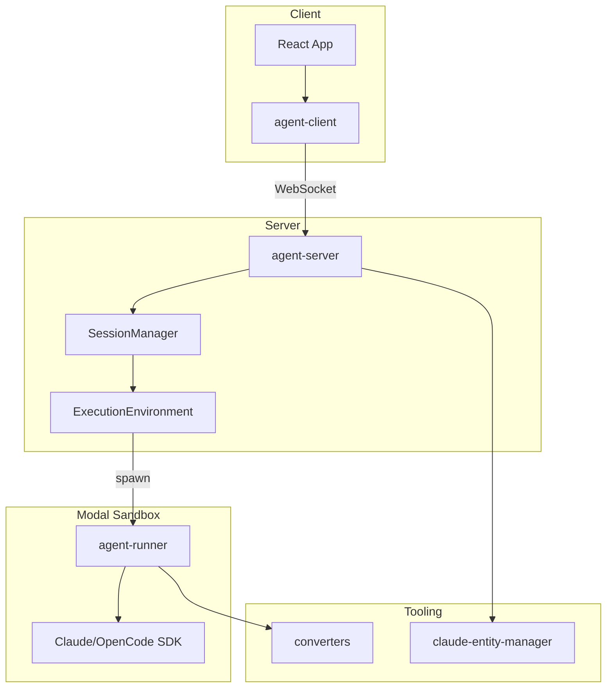

# Architecture Overview

High-level view of the ai-systems monorepo and how packages connect.

## What It Does

The ai-systems platform orchestrates AI agent execution across isolated sandboxes, providing:

- WebSocket-based client-server communication
- Sandbox isolation via Modal for secure agent execution
- Entity management for Claude Code plugins, skills, commands, and agents
- Transcript parsing and streaming for real-time UI updates

## How It Works

### Data Flow

1. **Client → Server**: User sends message via WebSocket
2. **Server → Sandbox**: SessionManager routes to ExecutionEnvironment
3. **Sandbox Execution**: agent-runner executes query against SDK
4. **Response Streaming**: StreamEvents flow back through the chain
5. **Transcript Parsing**: converters parse raw output into ConversationBlocks

## Package Categories

| Category | Packages | Purpose |
|----------|----------|---------|
| Runtime | agent-server, agent-client, agent-runner | Agent execution pipeline |
| Converters | converters | Transcript parsing, format conversion |
| Tooling | claude-entity-manager | Entity discovery, plugin management |
| Types | shared-types | Common type definitions |
| Apps | smart-docs | Documentation viewer |

## Key Components

| Component | Package | Purpose |
|-----------|---------|---------|
| SessionManager | agent-server | Orchestrates loaded sessions |
| ExecutionEnvironment | agent-server | Abstracts sandbox primitives |
| AgentSession | agent-server | Individual session state machine |
| agent-runner CLI | agent-runner | Executes queries in sandbox |
| ClaudeEntityManager | claude-entity-manager | Loads skills, commands, agents |

## Key Insight

The architecture separates **orchestration** (agent-server) from **execution** (agent-runner). The server never runs agent code directly—it spawns isolated sandboxes and communicates via streams. This enables:

- Security through isolation
- Horizontal scaling of sandboxes
- Clean separation between control plane and data plane

## Where It Lives

| Concern | Location |
|---------|----------|
| Client hooks | `runtime/client/src/` |
| Server orchestration | `runtime/server/src/core/` |
| Execution scripts | `runtime/runner/src/` |
| Transcript parsing | `packages/converters/src/` |
| Entity management | `packages/claude-entity-manager/src/` |
| Shared types | `packages/types/src/` |

## Related

- [Agent Execution](./agent-execution.md) - How queries flow through the system
- [Session Lifecycle](./session-lifecycle.md) - Session state management
- [Entity Management](./entity-management.md) - Plugin and entity discovery
