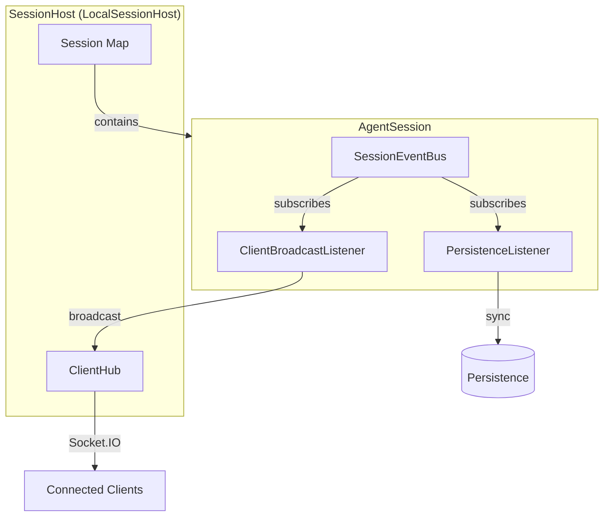

# Core Concepts

Key abstractions in the session management architecture.

## What It Does

The session architecture provides three key abstractions that separate concerns:

- **SessionHost** - Where sessions live and how they're located
- **SessionEventBus** - Per-session event publishing
- **ClientHub** - Broadcasting events to connected clients

These abstractions enable different deployment strategies (single server, distributed, serverless) without changing application code.

## How It Works



### Event Flow

1. **AgentSession** emits events to its **SessionEventBus** (e.g., `block:start`, `status:changed`)
2. **ClientBroadcastListener** subscribes to SessionEventBus, forwards events to **ClientHub**
3. **ClientHub** broadcasts to all clients subscribed to that session
4. **PersistenceListener** subscribes to SessionEventBus, syncs state changes to storage

### Key Design Decisions

- Events are **session-scoped** - no sessionId in payloads (implicit from bus instance)
- ClientHub is **internal to host implementations** - callers use `createAgentRuntime()` with `host: { type: 'local' }`
- Session list is **REST-only** - no WebSocket broadcast for list updates
- Runtime creates host internally based on `host.type` configuration

## SessionHost

Interface that abstracts where sessions live and how the server locates them.

```typescript
interface SessionHost {
  getSession(sessionId: string): AgentSession | undefined;
  createSession(args: CreateSessionArgs): Promise<AgentSession>;
  loadSession(sessionId: string): Promise<AgentSession>;
  unloadSession(sessionId: string): Promise<void>;
  isSessionLoaded(sessionId: string): boolean;
  getLoadedSessionIds(): string[];
  getAllSessions(): Promise<SessionListItem[]>;
  shutdown(): Promise<void>;
  setClientHub(clientHub: ClientHub): void;
  isHealthy(): boolean;
}
```

**Current implementation:** `LocalSessionHost` - in-memory Map, single server

**Future implementations:** DurableObjectSessionHost, ClusteredSessionHost

## SessionEventBus

Per-session typed event emitter. Each AgentSession owns its own instance.

```typescript
// Session-scoped events (no sessionId needed - implicit from bus)
interface SessionEvents {
  'block:start': { conversationId: string; block: ConversationBlock };
  'block:delta': { conversationId: string; blockId: string; delta: string };
  'block:complete': { conversationId: string; blockId: string; block: ConversationBlock };
  'status:changed': { runtime: SessionRuntimeState };
  'log': { level?: string; message: string };
  'error': { message: string; code?: string };
  // ... more events
}
```

**Subscribers:**
- `ClientBroadcastListener` - forwards to connected clients
- `PersistenceListener` - syncs state to storage

## ClientHub

Interface for broadcasting events to connected clients. Abstracts transport mechanism.

```typescript
interface ClientHub {
  broadcast<K extends keyof ClientHubEvents>(
    sessionId: string,
    event: K,
    data: ClientHubEvents[K]
  ): void;
  getClientCount(sessionId: string): number;
}
```

**Current implementation:** `SocketIOClientHub` - Socket.IO rooms

**Future implementations:** SSEClientHub, WebSocketClientHub, DurableObjectClientHub

## Key Insight

The architecture separates **what happens** (SessionEventBus emits typed events) from **who listens** (ClientHub broadcasts to clients, PersistenceListener syncs storage). This decoupling allows swapping transport and storage implementations independently.

## Where It Lives

| Concern | Location |
|---------|----------|
| SessionHost interface | `runtime/server/src/core/host/session-host.ts` |
| ClientHub interface | `runtime/server/src/core/host/client-hub.ts` |
| SessionEventBus | `runtime/server/src/core/session/session-event-bus.ts` |
| LocalSessionHost | `runtime/server/src/hosts/local/local-session-host.ts` |
| SocketIOClientHub | `runtime/server/src/hosts/local/socket-io-client-hub.ts` |
| ClientBroadcastListener | `runtime/server/src/core/session/client-broadcast-listener.ts` |
| PersistenceListener | `runtime/server/src/core/session/persistence-listener.ts` |

## Related

- [Architecture Overview](./architecture-overview.md) - System structure
- [Session Lifecycle](./session-lifecycle.md) - Session state management
- [Streaming and Events](./streaming-and-events.md) - Event types and flow
- [Hosting Strategies](../guides/hosting-strategies.md) - Deployment options
