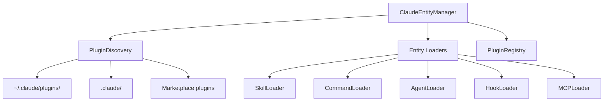

# Entity Management

How Claude Code entities (skills, commands, agents, hooks) are discovered and loaded.

## What It Does

Entity management provides:

- Discovery of entities from global, project, and plugin sources
- Loading and parsing of entity configurations
- Plugin installation, enabling, and updates
- Agent context assembly for sessions

## How It Works



### 1. Entity Sources

Entities are discovered from three source types:

| Source | Location | Priority |
|--------|----------|----------|
| Global | `~/.claude/` | Base configuration |
| Project | `.claude/` in project | Project-specific |
| Plugin | `~/.claude/plugins/<name>/` | Installable extensions |

### 2. Discovery Flow

```typescript
const context = await entityManager.loadAgentContext({
  projectDir: '/path/to/project',
  includeSkillFileContents: true,
});

// Returns: { skills, commands, subagents, hooks, mcpServers, memoryFiles }
```

The manager:
1. Scans global `~/.claude/` for entities
2. Scans project `.claude/` if provided
3. Discovers enabled plugins
4. Loads entities from each plugin
5. Loads CLAUDE.md memory files

### 3. Entity Types

```typescript
interface Skill {
  name: string;
  description: string;
  content?: string;  // Markdown content
  source: EntitySource;
}

interface Command {
  name: string;
  description: string;
  content: string;   // Command template
  source: EntitySource;
}

interface Agent {
  name: string;
  description: string;
  systemPrompt: string;
  tools: string[];
  source: EntitySource;
}

interface Hook {
  event: HookEvent;
  command: string;
  source: EntitySource;
}
```

### 4. Plugin Management

```typescript
// Install from marketplace
await entityManager.installPlugin('plugin-name@marketplace');

// Enable/disable
await entityManager.enablePlugin('plugin-id');
await entityManager.disablePlugin('plugin-id');

// Update
await entityManager.updatePlugin('plugin-id');
```

## Key Components

| Component | Package | Purpose |
|-----------|---------|---------|
| ClaudeEntityManager | claude-entity-manager | Main service class |
| PluginDiscovery | claude-entity-manager | Find installed plugins |
| PluginRegistry | claude-entity-manager | Track plugin metadata |
| SkillLoader | claude-entity-manager | Parse skill markdown |
| EntityWriter | claude-entity-manager | Write entities to disk |

## Plugin Structure

```
~/.claude/plugins/my-plugin/
├── plugin.json          # Manifest
├── skills/
│   └── my-skill.md
├── commands/
│   └── my-command.md
├── agents/
│   └── my-agent.md
└── hooks/
    └── hooks.json
```

### Plugin Manifest

```json
{
  "name": "my-plugin",
  "version": "1.0.0",
  "description": "Example plugin",
  "skills": ["skills/my-skill.md"],
  "commands": ["commands/my-command.md"],
  "agents": ["agents/my-agent.md"]
}
```

## Key Insight

The ClaudeEntityManager uses **loader classes** for each entity type. This allows consistent parsing patterns while accommodating different file formats (Markdown with frontmatter for skills, JSON for hooks, etc.).

## Where It Lives

| Concern | Location |
|---------|----------|
| Main service | `packages/claude-entity-manager/src/ClaudeEntityManager.ts` |
| Loaders | `packages/claude-entity-manager/src/loaders/` |
| Discovery | `packages/claude-entity-manager/src/discovery/` |
| Installation | `packages/claude-entity-manager/src/installation/` |
| Registry | `packages/claude-entity-manager/src/registry/` |

## Related

- [Architecture Overview](./architecture-overview.md) - System structure
- [claude-entity-manager](../packages/claude-entity-manager.md) - Package details
- [Agent Execution](./agent-execution.md) - How entities are used in sessions
