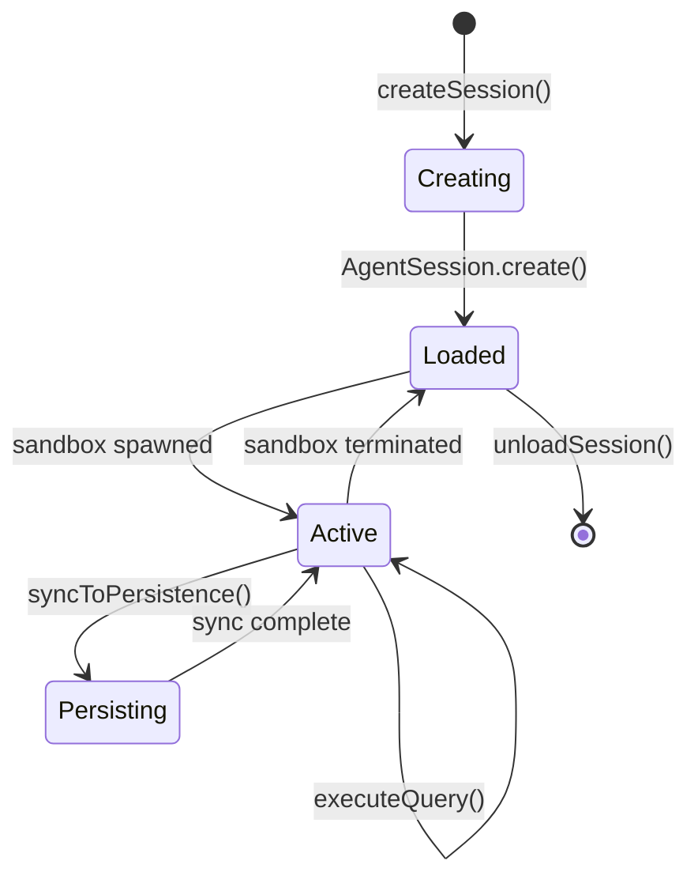

# Session Lifecycle

How agent sessions are created, managed, and persisted.

## What It Does

Session lifecycle management provides:

- Creation of new agent sessions with configuration
- Loading existing sessions from persistence
- Runtime state tracking (loaded, sandbox status)
- Graceful cleanup and persistence on termination

## How It Works



### 1. Session Creation

```typescript
const session = await sessionManager.createSession({
  agentProfileRef: 'my-agent',
  architecture: 'claude-sdk',
  sessionOptions: { model: 'claude-sonnet-4' }
});
```

The SessionManager:
1. Creates AgentSession via static factory
2. Registers session in loaded sessions map
3. Emits `sessions:changed` event

### 2. Session States

| State | Description |
|-------|-------------|
| **Unloaded** | Persisted but not in memory |
| **Loaded** | In memory, no active sandbox |
| **Active** | Sandbox running, ready for queries |

### 3. Sandbox Lifecycle

Modal sandboxes have idle timeouts. When terminated:

```typescript
// AgentSession notifies SessionManager via callback
handleSandboxTerminated(sessionId) {
  await this.unloadSession(sessionId);
}
```

### 4. Persistence

Sessions sync to persistence adapter:

```typescript
interface PersistenceAdapter {
  saveSession(data: PersistedSessionData): Promise<void>;
  loadSession(sessionId: string): Promise<PersistedSessionData>;
  listAllSessions(): Promise<SessionListItem[]>;
}
```

## Key Components

| Component | Package | Purpose |
|-----------|---------|---------|
| SessionManager | agent-server | Container for all sessions |
| AgentSession | agent-server | Individual session state |
| EventBus | agent-server | Domain event publishing |
| PersistenceAdapter | agent-server | Storage abstraction |

## Session Data Types

```typescript
// Full session data for persistence
interface PersistedSessionData {
  sessionId: string;
  agentProfileRef: string;
  architecture: AgentArchitecture;
  transcript: string;           // Raw SDK transcript
  blocks: ConversationBlock[];  // Parsed blocks
  createdAt: string;
  updatedAt: string;
}

// Runtime state (in-memory only)
interface SessionRuntimeState {
  isLoaded: boolean;
  sandbox: {
    id: string;
    status: 'starting' | 'running' | 'stopped';
  } | null;
}

// List view combines both
interface SessionListItem extends PersistedSessionData {
  runtime: SessionRuntimeState;
}
```

## Key Insight

The SessionManager uses **dependency injection** for all external dependencies (persistence, execution config). This makes testing straightforward and allows swapping implementations (e.g., SQLite vs. file-based persistence).

## Where It Lives

| Concern | Location |
|---------|----------|
| SessionManager | `runtime/server/src/core/session-manager.ts` |
| AgentSession | `runtime/server/src/core/agent-session.ts` |
| EventBus | `runtime/server/src/core/event-bus.ts` |
| Persistence types | `runtime/server/src/types/persistence-adapter.ts` |

## Related

- [Architecture Overview](./architecture-overview.md) - System structure
- [Agent Execution](./agent-execution.md) - Query execution flow
- [Streaming and Events](./streaming-and-events.md) - Event types
