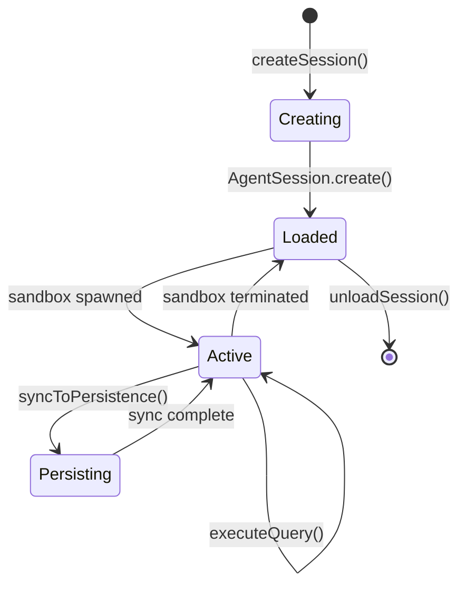

# Session Lifecycle

How agent sessions are created, managed, and persisted.

## What It Does

Session lifecycle management provides:

- Creation of new agent sessions with configuration
- Loading existing sessions from persistence
- Runtime state tracking (loaded, sandbox status)
- Graceful cleanup and persistence on termination

## How It Works



### 1. Session Creation

```typescript
const session = await sessionHost.createSession({
  agentProfileRef: 'my-agent',
  architecture: 'claude-sdk',
  sessionOptions: { model: 'claude-sonnet-4' }
});
```

The SessionHost:
1. Creates AgentSession with its own SessionEventBus
2. Registers session in loaded sessions map
3. Attaches ClientBroadcastListener and PersistenceListener

### 2. Session States

| State | Description |
|-------|-------------|
| **Unloaded** | Persisted but not in memory |
| **Loaded** | In memory, no active sandbox |
| **Active** | Sandbox running, ready for queries |

### 3. Sandbox Lifecycle

Modal sandboxes have idle timeouts. When terminated:

```typescript
// AgentSession notifies SessionManager via callback
handleSandboxTerminated(sessionId) {
  await this.unloadSession(sessionId);
}
```

### 4. Persistence

Sessions sync to persistence adapter:

```typescript
interface PersistenceAdapter {
  saveSession(data: PersistedSessionData): Promise<void>;
  loadSession(sessionId: string): Promise<PersistedSessionData>;
  listAllSessions(): Promise<SessionListItem[]>;
}
```

## Key Components

| Component | Package | Purpose |
|-----------|---------|---------|
| SessionHost | agent-server | Interface for session lifecycle |
| LocalSessionHost | agent-server | In-memory session hosting |
| AgentSession | agent-server | Individual session with event bus |
| SessionEventBus | agent-server | Per-session event publishing |
| PersistenceAdapter | agent-server | Storage abstraction |
| PersistenceListener | agent-server | Syncs events to storage |

## Session Data Types

```typescript
// Full session data for persistence
interface PersistedSessionData {
  sessionId: string;
  agentProfileRef: string;
  architecture: AgentArchitecture;
  transcript: string;           // Raw SDK transcript
  blocks: ConversationBlock[];  // Parsed blocks
  createdAt: string;
  updatedAt: string;
}

// Runtime state (in-memory only)
interface SessionRuntimeState {
  isLoaded: boolean;
  sandbox: {
    id: string;
    status: 'starting' | 'running' | 'stopped';
  } | null;
}

// List view combines both
interface SessionListItem extends PersistedSessionData {
  runtime: SessionRuntimeState;
}
```

## Key Insight

The SessionHost interface enables **pluggable hosting strategies**. LocalSessionHost uses an in-memory Map for single-server deployments. Future implementations (DurableObjectSessionHost, ClusteredSessionHost) can swap in without changing application code. Each AgentSession owns its own SessionEventBus for event-driven state management.

## Where It Lives

| Concern | Location |
|---------|----------|
| SessionHost interface | `runtime/server/src/core/host/session-host.ts` |
| LocalSessionHost | `runtime/server/src/hosts/local/local-session-host.ts` |
| AgentSession | `runtime/server/src/core/session/agent-session.ts` |
| SessionEventBus | `runtime/server/src/core/session/session-event-bus.ts` |
| PersistenceListener | `runtime/server/src/core/session/persistence-listener.ts` |
| Persistence types | `runtime/server/src/types/persistence-adapter.ts` |

## Related

- [Core Concepts](./core-concepts.md) - SessionHost, SessionEventBus, ClientHub patterns
- [Architecture Overview](./architecture-overview.md) - System structure
- [Agent Execution](./agent-execution.md) - Query execution flow
- [Streaming and Events](./streaming-and-events.md) - Event types
