# Streaming and Events

How agent responses stream through the system and are structured as conversation blocks.

## What It Does

The streaming system handles real-time agent output:

- Streams response chunks from SDK to client
- Normalizes events across different AI architectures
- Structures conversations as typed blocks
- Enables progressive UI rendering

## How It Works

```mermaid
flowchart LR
    SDK[Claude SDK] -->|raw events| Conv[Converters]
    Conv -->|SessionEvent| Runner[agent-runner]
    Runner -->|SessionEvent JSONL| EE[ExecutionEnvironment]
    EE -->|enriches context| SEB[SessionEventBus]
    SEB -->|session:event| CH[ClientHub]
    CH -->|broadcast| WS[WebSocket]
    WS -->|session:event| Client[React Client]
```



### 1. Event Flow

Events use a unified `SessionEvent` structure that flows unchanged through the entire pipeline:

```typescript
// SessionEvent structure - consistent from runner to client
interface SessionEvent<K extends SessionEventType> {
  type: K;                        // e.g., 'block:start', 'block:delta'
  payload: SessionEventPayloads[K]; // Type-safe payload
  context: SessionEventContext;   // sessionId, conversationId, source, timestamp
}

// ExecutionEnvironment enriches context (adds sessionId) without transforming
executeQuery(args, eventBus: SessionEventBus) {
  const process = await this.primitives.exec([...]);

  for await (const line of readLines(process.stdout)) {
    const event = JSON.parse(line) as SessionEvent;
    // Enrich with sessionId and emit unchanged
    const enriched = enrichEventContext(event, { sessionId });
    eventBus.emit(event.type, enriched);
  }
}

// ClientHub broadcasts single 'session:event' to all clients
eventBus.onAny((event) => {
  clientHub.broadcast(sessionId, 'session:event', event);
});
```

### 2. SessionEvent Types

Events are organized by category in `SessionEventPayloads`:

```typescript
// Block streaming events (high frequency during query execution)
'block:start'    // New block begins (may be incomplete)
'block:delta'    // Incremental text content
'block:update'   // Block metadata changes
'block:complete' // Block finalized

// Metadata events
'metadata:update' // Token usage, cost, model info

// Runtime status events
'status'          // Session runtime state changed

// File events (server-originated)
'file:created'   // File created in workspace
'file:modified'  // File modified in workspace
'file:deleted'   // File deleted from workspace

// Transcript events
'transcript:changed' // Combined transcript changed

// Subagent events
'subagent:discovered' // New subagent found
'subagent:completed'  // Subagent finished

// Operational events
'log'    // Operational log message
'error'  // Error occurred

// Options events
'options:update' // Session options changed
```

| Event | When Emitted |
|-------|--------------|
| `block:start` | New conversation block begins |
| `block:delta` | Each chunk of assistant/thinking text |
| `block:update` | Block status changes (e.g., tool pending → running) |
| `block:complete` | Block finalized with full content |
| `metadata:update` | Token usage or cost information |
| `status` | Session runtime state transitions |
| `log` | Informational logs from runner |
| `error` | Operational error occurred |

### 3. ConversationBlock Structure

After streaming completes, the transcript is parsed into blocks:

```typescript
type ConversationBlock =
  | TextBlock
  | ToolUseBlock
  | ToolResultBlock
  | ImageBlock;

interface TextBlock {
  type: 'text';
  role: 'user' | 'assistant';
  content: string;
}

interface ToolUseBlock {
  type: 'tool_use';
  toolName: string;
  toolId: string;
  input: Record<string, unknown>;
}

interface ToolResultBlock {
  type: 'tool_result';
  toolId: string;
  output: string;
  isError: boolean;
}
```

## Key Components

| Component | Package | Purpose |
|-----------|---------|---------|
| SessionEvent types | shared-types | Unified event definitions |
| SessionEventPayloads | shared-types | Type-safe payload map |
| ConversationBlock | shared-types | Structured message blocks |
| SessionEventBus | agent-server | Per-session event emitter |
| ClientHub | agent-server | Broadcasts to connected clients |
| createSessionEvent | shared-types | Factory for creating events |
| enrichEventContext | shared-types | Add context without transforming |

## Client-Side Handling

```typescript
// Single unified event handler
socket.on('session:event', (event: SessionEvent) => {
  switch (event.type) {
    case 'block:delta':
      appendToCurrentMessage(event.payload.delta);
      break;
    case 'block:complete':
      finalizeCurrentMessage(event.payload.block);
      break;
    case 'error':
      handleError(event.payload.message);
      break;
    case 'status':
      updateRuntimeState(event.payload.runtime);
      break;
  }
});
```

## Key Insight

SessionEvents are **low-level incremental updates** for real-time UI, while ConversationBlocks are **high-level structured data** for persistence and display. The system uses events during streaming, then parses the final transcript into blocks.

The unified event system means events flow unchanged from runner to client with a consistent `{ type, payload, context }` structure - no transformation layers needed.

## Where It Lives

| Concern | Location |
|---------|----------|
| SessionEvent types | `packages/types/src/runtime/session-events.ts` |
| ConversationBlock types | `packages/types/src/runtime/blocks.ts` |
| SessionEventBus | `runtime/server/src/core/session/session-event-bus.ts` |
| ClientHub interface | `runtime/server/src/core/host/client-hub.ts` |
| Event creation | `packages/types/src/runtime/session-events.ts` (createSessionEvent) |
| Runner output | `runtime/runner/src/cli/shared/output.ts` |

## Related

- [Core Concepts](./core-concepts.md) - SessionEventBus, ClientHub patterns
- [Architecture Overview](./architecture-overview.md) - System structure
- [Session Lifecycle](./session-lifecycle.md) - When events are emitted
- [agent-converters](../packages/agent-converters.md) - Transcript parsing
