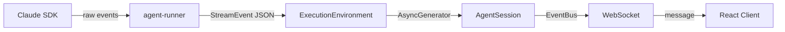

# Streaming and Events

How agent responses stream through the system and are structured as conversation blocks.

## What It Does

The streaming system handles real-time agent output:

- Streams response chunks from SDK to client
- Normalizes events across different AI architectures
- Structures conversations as typed blocks
- Enables progressive UI rendering

## How It Works



### 1. Event Flow

Events originate from the SDK and flow through layers:

```typescript
// In ExecutionEnvironment
async *executeQuery(args) {
  const process = await this.primitives.exec([...]);

  for await (const line of readLines(process.stdout)) {
    yield JSON.parse(line) as StreamEvent;
  }
}

// In AgentSession
for await (const event of this.executionEnv.executeQuery({ query })) {
  this.eventBus.emit('stream:event', { sessionId, event });
}
```

### 2. StreamEvent Types

StreamEvents are divided into conversation events and execution events:

```typescript
type StreamEvent =
  // Conversation events
  | BlockStartEvent       // New block begins (may be incomplete)
  | TextDeltaEvent        // Incremental text for streaming
  | BlockUpdateEvent      // Block metadata changes
  | BlockCompleteEvent    // Block finalized
  | MetadataUpdateEvent   // Token usage, cost updates
  // Execution events
  | StatusEvent           // Environment state changes
  | LogEvent              // Operational logs
  | ErrorEvent            // Operational errors
  | ScriptOutput;         // Final result from non-streaming commands
```

| Event | When Emitted |
|-------|--------------|
| `block_start` | New conversation block begins |
| `text_delta` | Each chunk of assistant/thinking text |
| `block_update` | Block status changes (e.g., tool pending → running) |
| `block_complete` | Block finalized with full content |
| `metadata_update` | Token usage or cost information |
| `status` | Execution environment state transitions |
| `log` | Informational logs from runner |
| `error` | Operational error occurred |
| `script_output` | Final result from non-streaming CLI commands |

### 3. ConversationBlock Structure

After streaming completes, the transcript is parsed into blocks:

```typescript
type ConversationBlock =
  | TextBlock
  | ToolUseBlock
  | ToolResultBlock
  | ImageBlock;

interface TextBlock {
  type: 'text';
  role: 'user' | 'assistant';
  content: string;
}

interface ToolUseBlock {
  type: 'tool_use';
  toolName: string;
  toolId: string;
  input: Record<string, unknown>;
}

interface ToolResultBlock {
  type: 'tool_result';
  toolId: string;
  output: string;
  isError: boolean;
}
```

## Key Components

| Component | Package | Purpose |
|-----------|---------|---------|
| StreamEvent types | shared-types | Event definitions |
| ConversationBlock | shared-types | Structured message blocks |
| TranscriptParser | converters | Parse raw transcripts |
| EventBus | agent-server | Event distribution |

## Client-Side Handling

```typescript
// In useAgentClient hook
socket.on('stream:event', (data) => {
  const { sessionId, event } = data;

  switch (event.type) {
    case 'text_delta':
      appendToCurrentMessage(event.delta);
      break;
    case 'message_complete':
      finalizeCurrentMessage(event.content);
      break;
    case 'error':
      handleError(event.message);
      break;
  }
});
```

## Key Insight

StreamEvents are **low-level incremental updates** for real-time UI, while ConversationBlocks are **high-level structured data** for persistence and display. The system uses events during streaming, then parses the final transcript into blocks.

## Where It Lives

| Concern | Location |
|---------|----------|
| StreamEvent types | `packages/types/src/runtime/stream-events.ts` |
| ConversationBlock types | `packages/types/src/runtime/blocks.ts` |
| Event emission | `runtime/server/src/core/event-bus.ts` |
| Transcript parsing | `packages/converters/src/` |
| Runner output utilities | `runtime/runner/src/cli/shared/output.ts` |

## Related

- [Architecture Overview](./architecture-overview.md) - System structure
- [Session Lifecycle](./session-lifecycle.md) - When events are emitted
- [agent-converters](../packages/agent-converters.md) - Transcript parsing
