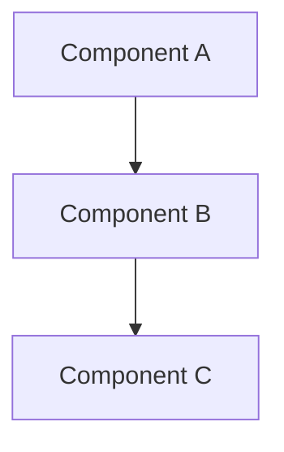

# Plan Template

Use this for design docs and technical plans in `plans/plan-name.md`.

---

```markdown
# [Plan Title]

## Overview

[What is this plan for? What problem does it solve?]

## Design

[The technical approach. Include diagrams where helpful:]



## Key Components

| Component | Purpose |
|-----------|---------|
| [Name] | [What it does] |

## Approach

### Phase 1: [Name]
[What happens in this phase]

### Phase 2: [Name]
[What happens in this phase]

[Break into phases if work is sequential]

## Open Questions

- [Question 1]
- [Question 2]

[Things to resolve before or during implementation]

## Risks

- [Risk 1]: [Mitigation]
- [Risk 2]: [Mitigation]

[Optional - include for complex or risky work]
```

---

## Usage Notes

- Plans are for upfront design, not documentation of what was built
- Keep them living documents - update as understanding evolves
- Once implemented, learnings should flow to permanent docs, not stay here
- Not every initiative needs a plan - use for complex work requiring design
