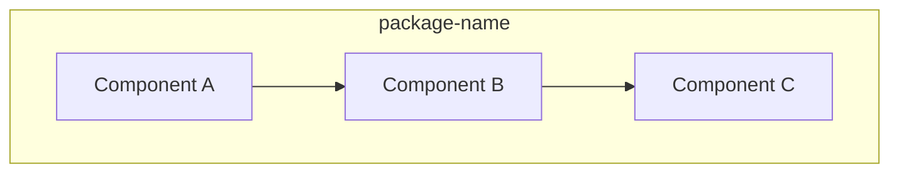

# Package Document Template

Use this template for documenting individual packages.

---

```markdown
# [Package Name]

[One-line description of what this package does.]

## What It Does

- [Responsibility 1]
- [Responsibility 2]
- [Responsibility 3]

## Architecture

[Diagram showing internal structure:]



[Brief prose explaining how the pieces fit together.]

## Core Components

| Component | File | Purpose |
|-----------|------|---------|
| [Name] | `src/path.ts` | [What it does] |

## Usage

```typescript
import { something } from '[package-name]';

// Basic usage pattern
const result = something.doThing({
  option: value
});
```

## Key Types

```typescript
// Only include types essential for understanding
interface MainConfig {
  required: string;
  optional?: number;
}
```

[Don't exhaustively list all types—link to source for full definitions.]

## How It Connects

| Direction | Package | Relationship |
|-----------|---------|--------------|
| Depends on | [other-package] | [Why] |
| Used by | [consuming-package] | [How] |

## Related

- [System Doc](../system/related.md) - [Relevant capability/concept]
- [Guide](../guides/related.md) - [Relevant how-to]
```

---

## Usage Notes

- "What It Does" should be scannable bullet points
- Architecture diagram shows internal structure, not external connections
- Usage example shows the common case, not every option
- Key Types shows only what's needed to understand the package
- Link to source for exhaustive type definitions
